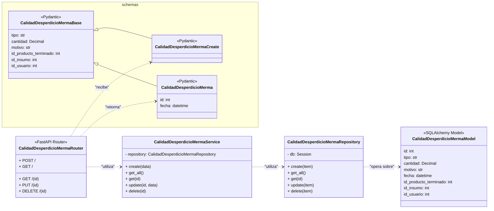

```mermaid
classDiagram
    direction LR

    class CalidadDesperdicioMermaRouter {
        <<FastAPI Router>>
        + POST /
        + GET /
        + GET /(id)
        + PUT /(id)
        + DELETE /(id)
    }

    class CalidadDesperdicioMermaService {
        - repository: CalidadDesperdicioMermaRepository
        + create(data)
        + get_all()
        + get(id)
        + update(id, data)
        + delete(id)
    }

    class CalidadDesperdicioMermaRepository {
        - db: Session
        + create(item)
        + get_all()
        + get(id)
        + update(item)
        + delete(item)
    }

    class CalidadDesperdicioMermaModel {
        <<SQLAlchemy Model>>
        id: int
        tipo: str
        cantidad: Decimal
        motivo: str
        fecha: datetime
        id_producto_terminado: int
        id_insumo: int
        id_usuario: int
    }

    namespace schemas {
        class CalidadDesperdicioMermaBase {
            <<Pydantic>>
            tipo: str
            cantidad: Decimal
            motivo: str
            id_producto_terminado: int
            id_insumo: int
            id_usuario: int
        }
        class CalidadDesperdicioMermaCreate {
            <<Pydantic>>
        }
        class CalidadDesperdicioMerma {
            <<Pydantic>>
            id: int
            fecha: datetime
        }
    }

    CalidadDesperdicioMermaRouter ..> CalidadDesperdicioMermaService : "utiliza"
    CalidadDesperdicioMermaService ..> CalidadDesperdicioMermaRepository : "utiliza"
    CalidadDesperdicioMermaRepository ..> CalidadDesperdicioMermaModel : "opera sobre"

    CalidadDesperdicioMermaRouter ..> CalidadDesperdicioMermaCreate : "recibe"
    CalidadDesperdicioMermaRouter ..> CalidadDesperdicioMerma : "retorna"

    CalidadDesperdicioMermaBase <|-- CalidadDesperdicioMermaCreate
    CalidadDesperdicioMermaBase <|-- CalidadDesperdicioMerma
```
