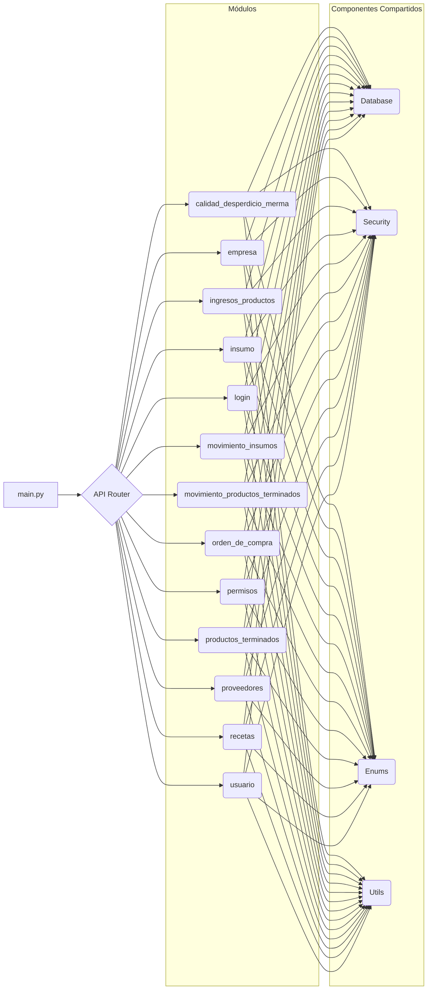

```mermaid
graph LR
    subgraph "Módulos"
        direction TB
        C(calidad_desperdicio_merma)
        D(empresa)
        E(ingresos_productos)
        F(insumo)
        G(login)
        H(movimiento_insumos)
        I(movimiento_productos_terminados)
        J(orden_de_compra)
        K(permisos)
        L(productos_terminados)
        M(proveedores)
        N(recetas)
        O(usuario)
    end

    subgraph "Componentes Compartidos"
        direction TB
        P(Database)
        Q(Security)
        R(Enums)
        S(Utils)
    end

    A[main.py] --> B{API Router}
    B --> C & D & E & F & G & H & I & J & K & L & M & N & O
    C & D & E & F & G & H & I & J & K & L & M & N & O --> P & Q & R & S
```
