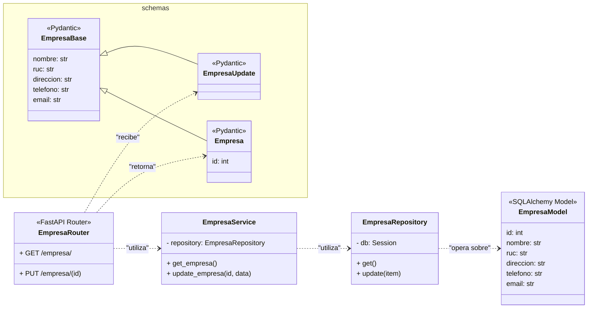

```mermaid
classDiagram
    direction LR

    class EmpresaRouter {
        <<FastAPI Router>>
        + GET /empresa/
        + PUT /empresa/(id)
    }

    class EmpresaService {
        - repository: EmpresaRepository
        + get_empresa()
        + update_empresa(id, data)
    }

    class EmpresaRepository {
        - db: Session
        + get()
        + update(item)
    }

    class EmpresaModel {
        <<SQLAlchemy Model>>
        id: int
        nombre: str
        ruc: str
        direccion: str
        telefono: str
        email: str
    }

    namespace schemas {
        class EmpresaBase {
            <<Pydantic>>
            nombre: str
            ruc: str
            direccion: str
            telefono: str
            email: str
        }
        class EmpresaUpdate {
            <<Pydantic>>
        }
        class Empresa {
            <<Pydantic>>
            id: int
        }
    }

    EmpresaRouter ..> EmpresaService : "utiliza"
    EmpresaService ..> EmpresaRepository : "utiliza"
    EmpresaRepository ..> EmpresaModel : "opera sobre"

    EmpresaRouter ..> EmpresaUpdate : "recibe"
    EmpresaRouter ..> Empresa : "retorna"

    EmpresaBase <|-- EmpresaUpdate
    EmpresaBase <|-- Empresa
```
