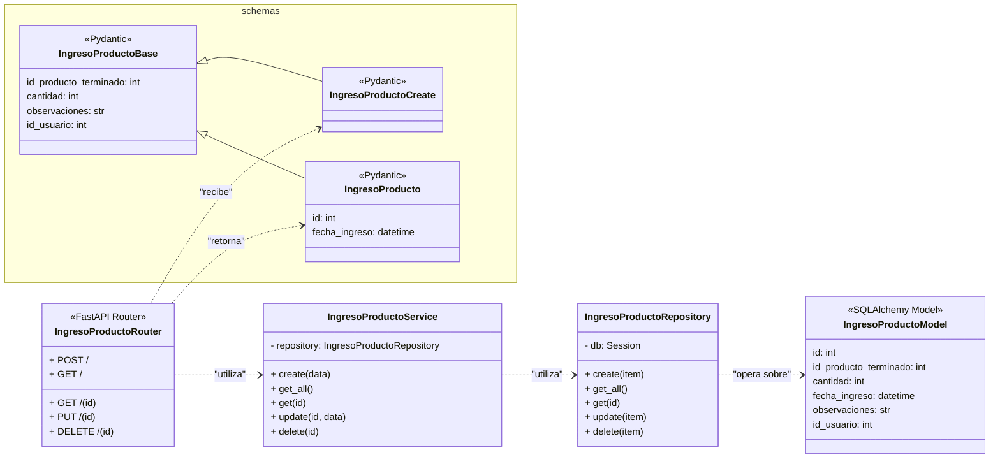

```mermaid
classDiagram
    direction LR

    class IngresoProductoRouter {
        <<FastAPI Router>>
        + POST /
        + GET /
        + GET /(id)
        + PUT /(id)
        + DELETE /(id)
    }

    class IngresoProductoService {
        - repository: IngresoProductoRepository
        + create(data)
        + get_all()
        + get(id)
        + update(id, data)
        + delete(id)
    }

    class IngresoProductoRepository {
        - db: Session
        + create(item)
        + get_all()
        + get(id)
        + update(item)
        + delete(item)
    }

    class IngresoProductoModel {
        <<SQLAlchemy Model>>
        id: int
        id_producto_terminado: int
        cantidad: int
        fecha_ingreso: datetime
        observaciones: str
        id_usuario: int
    }

    namespace schemas {
        class IngresoProductoBase {
            <<Pydantic>>
            id_producto_terminado: int
            cantidad: int
            observaciones: str
            id_usuario: int
        }
        class IngresoProductoCreate {
            <<Pydantic>>
        }
        class IngresoProducto {
            <<Pydantic>>
            id: int
            fecha_ingreso: datetime
        }
    }

    IngresoProductoRouter ..> IngresoProductoService : "utiliza"
    IngresoProductoService ..> IngresoProductoRepository : "utiliza"
    IngresoProductoRepository ..> IngresoProductoModel : "opera sobre"

    IngresoProductoRouter ..> IngresoProductoCreate : "recibe"
    IngresoProductoRouter ..> IngresoProducto : "retorna"

    IngresoProductoBase <|-- IngresoProductoCreate
    IngresoProductoBase <|-- IngresoProducto
```
