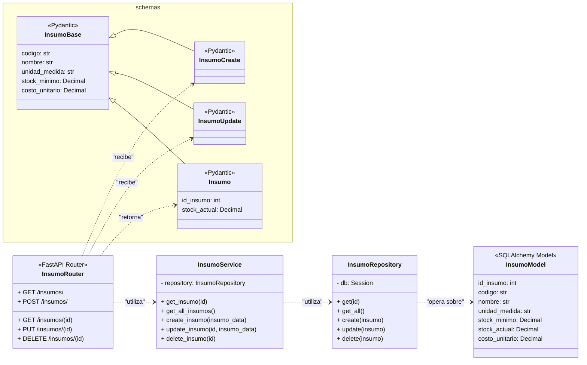

```mermaid
classDiagram
    direction LR

    class InsumoRouter {
        <<FastAPI Router>>
        + GET /insumos/
        + GET /insumos/(id)
        + POST /insumos/
        + PUT /insumos/(id)
        + DELETE /insumos/(id)
    }

    class InsumoService {
        - repository: InsumoRepository
        + get_insumo(id)
        + get_all_insumos()
        + create_insumo(insumo_data)
        + update_insumo(id, insumo_data)
        + delete_insumo(id)
    }

    class InsumoRepository {
        - db: Session
        + get(id)
        + get_all()
        + create(insumo)
        + update(insumo)
        + delete(insumo)
    }

    class InsumoModel {
        <<SQLAlchemy Model>>
        id_insumo: int
        codigo: str
        nombre: str
        unidad_medida: str
        stock_minimo: Decimal
        stock_actual: Decimal
        costo_unitario: Decimal
    }

    namespace schemas {
        class InsumoBase {
            <<Pydantic>>
            codigo: str
            nombre: str
            unidad_medida: str
            stock_minimo: Decimal
            costo_unitario: Decimal
        }
        class InsumoCreate {
            <<Pydantic>>
        }
        class InsumoUpdate {
            <<Pydantic>>
        }
        class Insumo {
            <<Pydantic>>
            id_insumo: int
            stock_actual: Decimal
        }
    }

    InsumoRouter ..> InsumoService : "utiliza"
    InsumoService ..> InsumoRepository : "utiliza"
    InsumoRepository ..> InsumoModel : "opera sobre"

    InsumoRouter ..> InsumoCreate : "recibe"
    InsumoRouter ..> InsumoUpdate : "recibe"
    InsumoRouter ..> Insumo : "retorna"

    InsumoBase <|-- InsumoCreate
    InsumoBase <|-- InsumoUpdate
    InsumoBase <|-- Insumo
```
