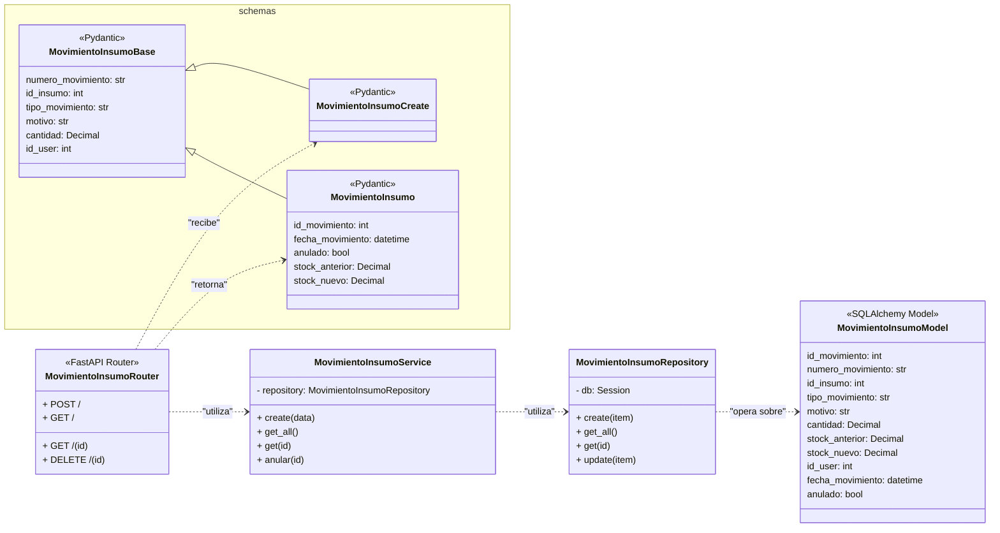

```mermaid
classDiagram
    direction LR

    class MovimientoInsumoRouter {
        <<FastAPI Router>>
        + POST /
        + GET /
        + GET /(id)
        + DELETE /(id)
    }

    class MovimientoInsumoService {
        - repository: MovimientoInsumoRepository
        + create(data)
        + get_all()
        + get(id)
        + anular(id)
    }

    class MovimientoInsumoRepository {
        - db: Session
        + create(item)
        + get_all()
        + get(id)
        + update(item)
    }

    class MovimientoInsumoModel {
        <<SQLAlchemy Model>>
        id_movimiento: int
        numero_movimiento: str
        id_insumo: int
        tipo_movimiento: str
        motivo: str
        cantidad: Decimal
        stock_anterior: Decimal
        stock_nuevo: Decimal
        id_user: int
        fecha_movimiento: datetime
        anulado: bool
    }

    namespace schemas {
        class MovimientoInsumoBase {
            <<Pydantic>>
            numero_movimiento: str
            id_insumo: int
            tipo_movimiento: str
            motivo: str
            cantidad: Decimal
            id_user: int
        }
        class MovimientoInsumoCreate {
            <<Pydantic>>
        }
        class MovimientoInsumo {
            <<Pydantic>>
            id_movimiento: int
            fecha_movimiento: datetime
            anulado: bool
            stock_anterior: Decimal
            stock_nuevo: Decimal
        }
    }

    MovimientoInsumoRouter ..> MovimientoInsumoService : "utiliza"
    MovimientoInsumoService ..> MovimientoInsumoRepository : "utiliza"
    MovimientoInsumoRepository ..> MovimientoInsumoModel : "opera sobre"

    MovimientoInsumoRouter ..> MovimientoInsumoCreate : "recibe"
    MovimientoInsumoRouter ..> MovimientoInsumo : "retorna"

    MovimientoInsumoBase <|-- MovimientoInsumoCreate
    MovimientoInsumoBase <|-- MovimientoInsumo
```
