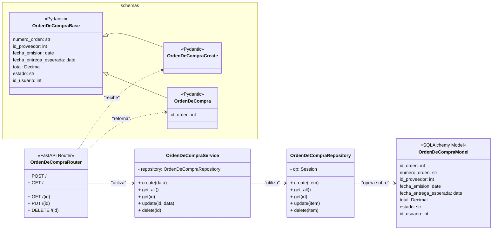

```mermaid
classDiagram
    direction LR

    class OrdenDeCompraRouter {
        <<FastAPI Router>>
        + POST /
        + GET /
        + GET /(id)
        + PUT /(id)
        + DELETE /(id)
    }

    class OrdenDeCompraService {
        - repository: OrdenDeCompraRepository
        + create(data)
        + get_all()
        + get(id)
        + update(id, data)
        + delete(id)
    }

    class OrdenDeCompraRepository {
        - db: Session
        + create(item)
        + get_all()
        + get(id)
        + update(item)
        + delete(item)
    }

    class OrdenDeCompraModel {
        <<SQLAlchemy Model>>
        id_orden: int
        numero_orden: str
        id_proveedor: int
        fecha_emision: date
        fecha_entrega_esperada: date
        total: Decimal
        estado: str
        id_usuario: int
    }

    namespace schemas {
        class OrdenDeCompraBase {
            <<Pydantic>>
            numero_orden: str
            id_proveedor: int
            fecha_emision: date
            fecha_entrega_esperada: date
            total: Decimal
            estado: str
            id_usuario: int
        }
        class OrdenDeCompraCreate {
            <<Pydantic>>
        }
        class OrdenDeCompra {
            <<Pydantic>>
            id_orden: int
        }
    }

    OrdenDeCompraRouter ..> OrdenDeCompraService : "utiliza"
    OrdenDeCompraService ..> OrdenDeCompraRepository : "utiliza"
    OrdenDeCompraRepository ..> OrdenDeCompraModel : "opera sobre"

    OrdenDeCompraRouter ..> OrdenDeCompraCreate : "recibe"
    OrdenDeCompraRouter ..> OrdenDeCompra : "retorna"

    OrdenDeCompraBase <|-- OrdenDeCompraCreate
    OrdenDeCompraBase <|-- OrdenDeCompra
```
