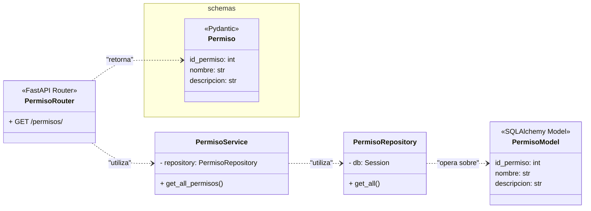

```mermaid
classDiagram
    direction LR

    class PermisoRouter {
        <<FastAPI Router>>
        + GET /permisos/
    }

    class PermisoService {
        - repository: PermisoRepository
        + get_all_permisos()
    }

    class PermisoRepository {
        - db: Session
        + get_all()
    }

    class PermisoModel {
        <<SQLAlchemy Model>>
        id_permiso: int
        nombre: str
        descripcion: str
    }

    namespace schemas {
        class Permiso {
            <<Pydantic>>
            id_permiso: int
            nombre: str
            descripcion: str
        }
    }

    PermisoRouter ..> PermisoService : "utiliza"
    PermisoService ..> PermisoRepository : "utiliza"
    PermisoRepository ..> PermisoModel : "opera sobre"
    PermisoRouter ..> Permiso : "retorna"

```

