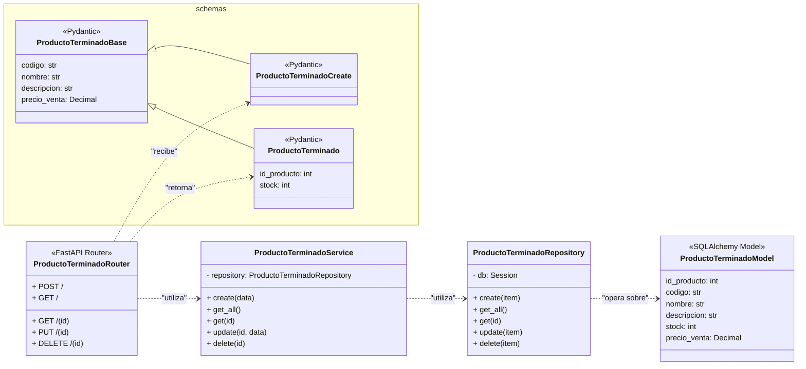

```mermaid
classDiagram
    direction LR

    class ProductoTerminadoRouter {
        <<FastAPI Router>>
        + POST /
        + GET /
        + GET /(id)
        + PUT /(id)
        + DELETE /(id)
    }

    class ProductoTerminadoService {
        - repository: ProductoTerminadoRepository
        + create(data)
        + get_all()
        + get(id)
        + update(id, data)
        + delete(id)
    }

    class ProductoTerminadoRepository {
        - db: Session
        + create(item)
        + get_all()
        + get(id)
        + update(item)
        + delete(item)
    }

    class ProductoTerminadoModel {
        <<SQLAlchemy Model>>
        id_producto: int
        codigo: str
        nombre: str
        descripcion: str
        stock: int
        precio_venta: Decimal
    }

    namespace schemas {
        class ProductoTerminadoBase {
            <<Pydantic>>
            codigo: str
            nombre: str
            descripcion: str
            precio_venta: Decimal
        }
        class ProductoTerminadoCreate {
            <<Pydantic>>
        }
        class ProductoTerminado {
            <<Pydantic>>
            id_producto: int
            stock: int
        }
    }

    ProductoTerminadoRouter ..> ProductoTerminadoService : "utiliza"
    ProductoTerminadoService ..> ProductoTerminadoRepository : "utiliza"
    ProductoTerminadoRepository ..> ProductoTerminadoModel : "opera sobre"

    ProductoTerminadoRouter ..> ProductoTerminadoCreate : "recibe"
    ProductoTerminadoRouter ..> ProductoTerminado : "retorna"

    ProductoTerminadoBase <|-- ProductoTerminadoCreate
    ProductoTerminadoBase <|-- ProductoTerminado
```
