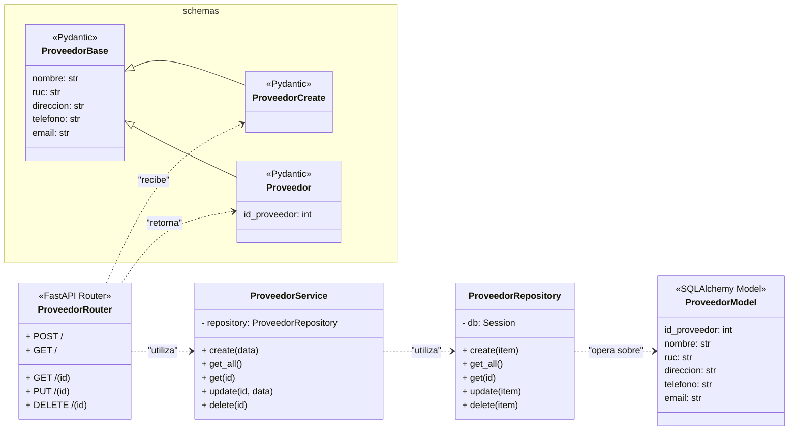

```mermaid
classDiagram
    direction LR

    class ProveedorRouter {
        <<FastAPI Router>>
        + POST /
        + GET /
        + GET /(id)
        + PUT /(id)
        + DELETE /(id)
    }

    class ProveedorService {
        - repository: ProveedorRepository
        + create(data)
        + get_all()
        + get(id)
        + update(id, data)
        + delete(id)
    }

    class ProveedorRepository {
        - db: Session
        + create(item)
        + get_all()
        + get(id)
        + update(item)
        + delete(item)
    }

    class ProveedorModel {
        <<SQLAlchemy Model>>
        id_proveedor: int
        nombre: str
        ruc: str
        direccion: str
        telefono: str
        email: str
    }

    namespace schemas {
        class ProveedorBase {
            <<Pydantic>>
            nombre: str
            ruc: str
            direccion: str
            telefono: str
            email: str
        }
        class ProveedorCreate {
            <<Pydantic>>
        }
        class Proveedor {
            <<Pydantic>>
            id_proveedor: int
        }
    }

    ProveedorRouter ..> ProveedorService : "utiliza"
    ProveedorService ..> ProveedorRepository : "utiliza"
    ProveedorRepository ..> ProveedorModel : "opera sobre"

    ProveedorRouter ..> ProveedorCreate : "recibe"
    ProveedorRouter ..> Proveedor : "retorna"

    ProveedorBase <|-- ProveedorCreate
    ProveedorBase <|-- Proveedor
```
