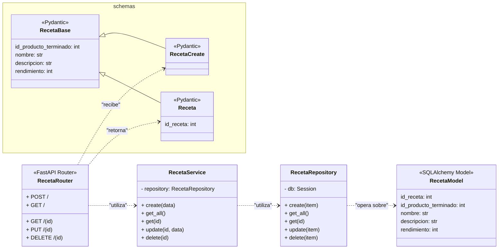

```mermaid
classDiagram
    direction LR

    class RecetaRouter {
        <<FastAPI Router>>
        + POST /
        + GET /
        + GET /(id)
        + PUT /(id)
        + DELETE /(id)
    }

    class RecetaService {
        - repository: RecetaRepository
        + create(data)
        + get_all()
        + get(id)
        + update(id, data)
        + delete(id)
    }

    class RecetaRepository {
        - db: Session
        + create(item)
        + get_all()
        + get(id)
        + update(item)
        + delete(item)
    }

    class RecetaModel {
        <<SQLAlchemy Model>>
        id_receta: int
        id_producto_terminado: int
        nombre: str
        descripcion: str
        rendimiento: int
    }

    namespace schemas {
        class RecetaBase {
            <<Pydantic>>
            id_producto_terminado: int
            nombre: str
            descripcion: str
            rendimiento: int
        }
        class RecetaCreate {
            <<Pydantic>>
        }
        class Receta {
            <<Pydantic>>
            id_receta: int
        }
    }

    RecetaRouter ..> RecetaService : "utiliza"
    RecetaService ..> RecetaRepository : "utiliza"
    RecetaRepository ..> RecetaModel : "opera sobre"

    RecetaRouter ..> RecetaCreate : "recibe"
    RecetaRouter ..> Receta : "retorna"

    RecetaBase <|-- RecetaCreate
    RecetaBase <|-- Receta
```
