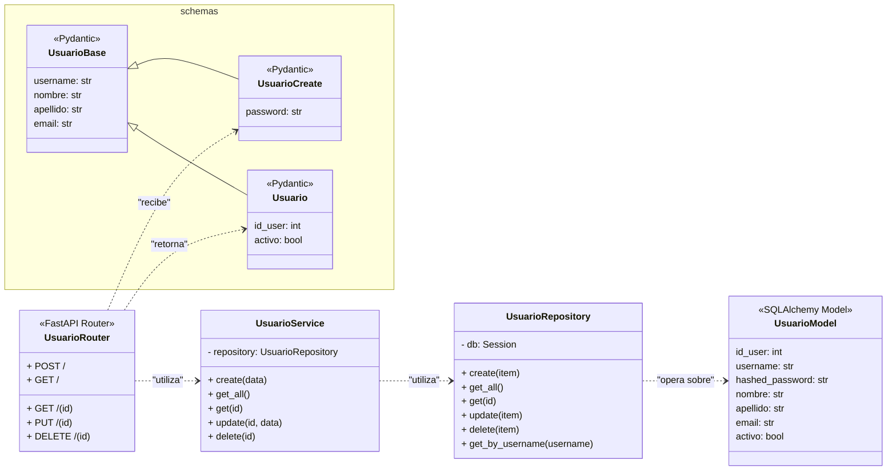

```mermaid
classDiagram
    direction LR

    class UsuarioRouter {
        <<FastAPI Router>>
        + POST /
        + GET /
        + GET /(id)
        + PUT /(id)
        + DELETE /(id)
    }

    class UsuarioService {
        - repository: UsuarioRepository
        + create(data)
        + get_all()
        + get(id)
        + update(id, data)
        + delete(id)
    }

    class UsuarioRepository {
        - db: Session
        + create(item)
        + get_all()
        + get(id)
        + update(item)
        + delete(item)
        + get_by_username(username)
    }

    class UsuarioModel {
        <<SQLAlchemy Model>>
        id_user: int
        username: str
        hashed_password: str
        nombre: str
        apellido: str
        email: str
        activo: bool
    }

    namespace schemas {
        class UsuarioBase {
            <<Pydantic>>
            username: str
            nombre: str
            apellido: str
            email: str
        }
        class UsuarioCreate {
            <<Pydantic>>
            password: str
        }
        class Usuario {
            <<Pydantic>>
            id_user: int
            activo: bool
        }
    }

    UsuarioRouter ..> UsuarioService : "utiliza"
    UsuarioService ..> UsuarioRepository : "utiliza"
    UsuarioRepository ..> UsuarioModel : "opera sobre"

    UsuarioRouter ..> UsuarioCreate : "recibe"
    UsuarioRouter ..> Usuario : "retorna"

    UsuarioBase <|-- UsuarioCreate
    UsuarioBase <|-- Usuario
```
